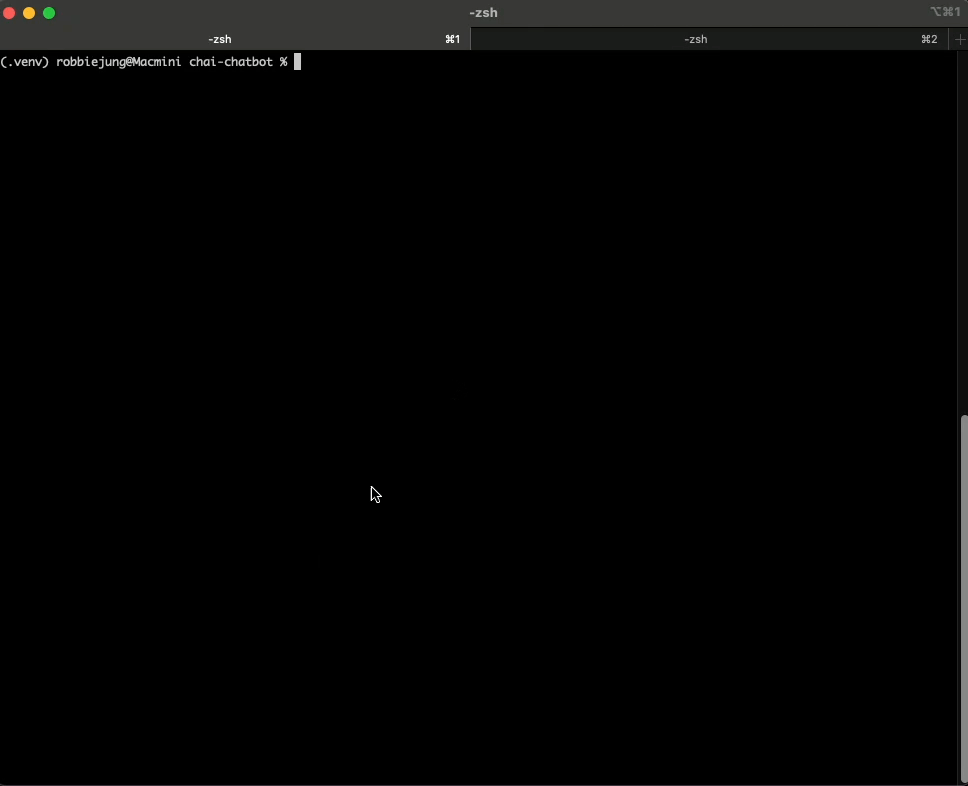

# Python WebSocket Chatbot Server and Client

This project contains a WebSocket-based chatbot server (using Chai API) and a Python client script for interactive chat.

**Features:**
- Supports multiple simultaneous client connections (each tracked by user name)
- User name is sent in WebSocket headers and validated by the server
- rate limiting per user
- Chat history is kept per session (in-memory)

## Notes
- Logs are written to the `logs/` directory.
- Make sure the server is running before starting the client.
- All configuration is managed via the `dev.env` file in the project root.

## Requirements
- Python 3.7+
- install dependencies in requirements.txt

## Setup
1. Run a install script
```
install_mac.sh
```
2. Updated a `dev.env` file in the project root.
- API_URL=your_chatbot_url 
- API_KEY=your_api_key_here
- RATE_LIMIT_MAX_CALLS=100 # number of call
- RATE_LIMIT_PERIOD=60 # seconds

## Running the Server
- Start the WebSocket server:
   ```
   source .venv/bin/activate
   python chatbot_server.py
   ```
   The server will listen on `ws://localhost:8765`.

## Running the Client
In a separate terminal (and with the virtual environment activated), run:
```
source .venv/bin/activate 
python chatbot_client.py
```
You will be prompted for your user name and whether to start a new chat or continue an existing one.
Type your message and press Enter to chat. Type `exit` or `quit` to end the session.


## Managing the Server in the Background
You could run the server in the backgroud and run a client on same terminal. 
```
python chatbot_client.py &
```
To check if the server is running and kill it
```
lsof -i :8765
kill <PID>  # e.g. kill 7011
```

## Run the tests
Tests are written using `pytest` and organized in the `tests/` directory.
To run all tests:
pytest
To run a specific test file:
pytest tests/path/to/test_file.py
To check code style and linting:
flake8
To auto-format code:
autoflake --in-place --remove-unused-variables --remove-all-unused-imports -r .

## Next Steps
- Store chat history in permanent storage and load it when server restarts
- Expand test coverage for error and edge cases